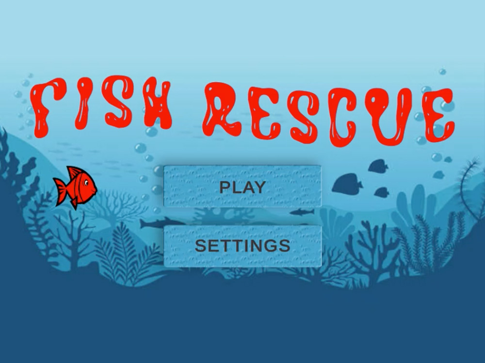
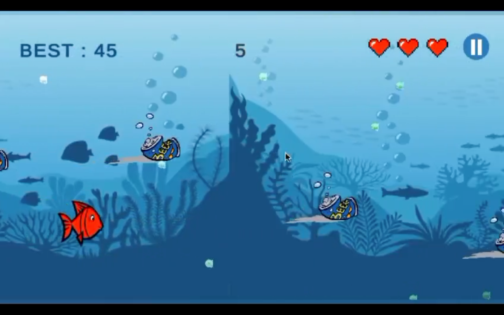

Game Name: Fish Rescue
Character: A lively red fish trying to make its way 
Levels: Endless Runner 

Storyline:
Fish Rescue is an exciting endless runner game set in the depths of the ocean. The game aims to raise awareness about ocean pollution and the importance of preserving marine life. Through gameplay, players can learn about the impact of human activities on aquatic ecosystems and inspire them to take action in real life. 

Dive into an immersive underwater world where you control a colorful fish on a thrilling adventure. Your mission is to help the fish swim through the water while avoiding environmentally hazardous obstacles.
As the fish gracefully glides through the vibrant ocean, you must navigate it skillfully to dodge the incoming trash obstacles threatening its journey. 

The game offers intuitive controls that allow you to guide the fish with precision. Use Keyboard Arrow Keys or WASD keys to control its movements as you navigate through challenging underwater landscape. 

Test your reflexes and decision-making skills as you strive to set new records and reach the top of the leaderboards. With stunning visuals, captivating sound effects, and an immersive underwater ambiance, Fish Rescue offers an unforgettable gaming experience. Embark on this thrilling underwater adventure and help the fish escape the perils of pollution in Aquatic Escape. Swim, dodge, and navigate your way to freedom in this addictive endless runner game!

